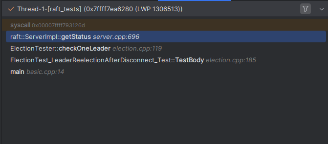
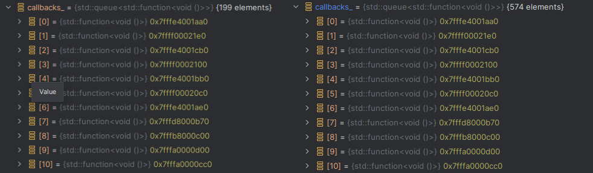

\page initialization-race "2025-08-16: Check the Member Declaration Order"

# 2025-08-16: Check the Member Declaration Order

## TLDR:

- Initialization order matters.
- Try to initialize threads after the rest of your constructor's logic has run.

## Introduction

This bug took me about a day to fix. A few moments prior to noticing this bug, I had just
gotten all the tests for election logic to pass. To ensure that this behavior was consistent, I decided to run
`./build/tests/raft_tests/raft_tests --gtest_repeat=100`. On the 20th iteration, I got the following output:

```
Repeating all tests (iteration 19) . . .
[2025-08-16 23:05:23.707] [debug] [A] received AppendEntries response with error: variant(unknown error: network detached from A to B)
[2025-08-16 23:05:23.707] [debug] [A] received AppendEntries response with error: variant(unknown error: network detached from A to C)
/*  Continues... */

Repeating all tests (iteration 20) . . .

...
```

And the test just kept on going. No output at all, and no indication of an error.

I quickly noticed a few things:

1. One of two election tests would fail. The ordering of these failures changed every time, and
2. The tests would fail far more frequently when the debugger was attached and in debug mode.
3. Both the thread sanitizer and the address sanitizer did not report any errors.

I assumed that I had caused a deadlock somewhere. To verify this, I paused the debugger and encountered this:


Where `getStatus` was the following block (simplified):

```c++
Status ServerImpl::getStatus() const
{
    std::promise<Status> promise;
    auto future = promise.get_future();
    asio::post(strand_,
               [this, &promise]
               {
                   Status status = status_;
                   postPersist(
                       [this, &promise, status]
                       {
                           promise.set_value(status);
                       });
               });
    return future.get();
};
```

and `postPersist` was the following (simplified):

```c++
void ServerImpl::postPersist(std::function<void(tl::expected<void, Error>)> callback) const
{
    auto cb = [this, callback = std::move(callback)]
    {
        // PersistenceHandler may run the callback on a different thread, so we post it back to
        // the strand.
        asio::post(strand_, [callback] { callback({}); });
    };
    persistenceHandler_->addRequest(impl::PersistenceRequest {.data = data, .callback = cb});
}
```

So, there were three possible causes:

1. Either our strand had already deadlocked.
2. Our persister wasn't calling our provided callback.
3. One of our callbacks was deadlocking the persister.

I managed to eliminate (1) by adding additional logging. I also managed to eliminate (3) by adding logs prior to and
after
the execution of a callback within the persister. Additionally, our persister wasn't deadlocking, since I could easily
see the number of persister callbacks increasing (but not
decreasing).

*Right: the persister after a second more of execution. Clearly not a deadlock.*

So what was causing (2)?

## The Problem

Here's a sketch of the persister's code:

```c++
struct PersistenceRequest
{
    std::vector<std::byte> data;
    std::function<void()> callback;
};

// Handles persistence requests in batches in a separate thread. This calls the Persister's
// saveState method whenever either the timer expires and the queue is not empty, or if the size
// of the queue exceeds the maximum. We only persist the most recent state, but each callback
// will be run.
class PersistenceHandler
{
  public:
    PersistenceHandler(std::shared_ptr<Persister> persister,
                       std::chrono::microseconds interval,
                       uint64_t maxEntries)
        : persister_(std::move(persister))
        , interval_(interval)
        , maxEntries_(maxEntries)
        , thread_(&PersistenceHandler::run, this)
    {
        resetTimer();
    }

    ~PersistenceHandler()
    {
        {
            std::lock_guard lock {mutex_};
            running_ = false;
        }
        condition_.notify_all();
        thread_.join();
    }

    void addRequest(PersistenceRequest request)
    {
        std::lock_guard lock {mutex_};
        callbacks_.push(std::move(request.callback));
        data_ = std::move(request.data);
        condition_.notify_all();
    }

  private:
    void resetTimer() { lastPersisted_ = std::chrono::steady_clock::now(); }
    void run()
    {
        while (true)
        {
            std::unique_lock lock {mutex_};
            condition_.wait_until(lock,
                                  nextPersistTime(),
                                  [this]
                                  {
                                      bool timeout = std::chrono::steady_clock::now() >= nextPersistTime();
                                      return timeout || callbacks_.size() >= maxEntries_
                                          || !running_;
                                  });
            if (!running_)
            {
                return;
            }
            if (callbacks_.empty())
            {
                resetTimer();
                continue;
            }

            resetTimer();
            persist(lock);
        }
    }

    void persist(std::unique_lock<std::mutex>& lock)
    {
        std::queue<std::function<void()> > requests;
        requests.swap(callbacks_);

        std::vector<std::byte> data;
        data.swap(data_);

        lock.unlock();

        persister_->saveState(data);
        int counter = 0;
        while (!requests.empty())
        {
            auto& callback = requests.front();
            callback();
            requests.pop();
            counter++;
        }
    }

    [[nodiscard]] std::chrono::time_point<std::chrono::steady_clock> nextPersistTime() const
    {
        return lastPersisted_ + interval_;
    }

    std::chrono::time_point<std::chrono::steady_clock> lastPersisted_;
    std::shared_ptr<Persister> persister_;
    std::chrono::microseconds interval_;
    uint64_t maxEntries_;

    std::mutex mutex_;
    std::queue<std::function<void()> > callbacks_;
    std::vector<std::byte> data_;
    std::condition_variable condition_;

    std::thread thread_;
    bool running_ = true;
};
```

You might think that the issue's in the condition_logic, but I ruled that out after adding more logging.
I resorted to simulating the code in my mind line-by-line, and it turned out to be in one place I didn't
expect it: `running_` causing an early return.

In C++, **member variables are initialized in the order they are declared in the class, not the order they
appear in the
constructor's initializer list (or even member list, as in this case).** Essentially, `thread_` is initialized before
`running_`. This creates a race condition where the new thread reads the indeterminate, pre-initialized value of
`running_` (which in this case was effectively `false`), causing it to exit prematurely.

In other words, the thread will run the block:

```c++
condition_.wait_until(lock,
                      nextPersistTime(),
                      [this]
                      {
                          bool timeout = std::chrono::steady_clock::now() >= nextPersistTime();
                          return timeout || callbacks_.size() >= maxEntries_
                              || !running_;
                      });
if (!running_)
{
    return;
}
```

causing an early return. This results in no more callbacks being executed, ultimately ending up in a deadlock[^1].

## The Fix

Simply reorder the initialization of `running_` and `thread_`.

```c++
// ...
std::thread thread_(&PersistenceHandler::run, this);
bool running_ = true;
// ...
```

For future-proofing, I also changed the constructor to be:

```c++
PersistenceHandler(std::shared_ptr<Persister> persister,
                                            std::chrono::microseconds interval,
                                            uint64_t maxEntries)
         : persister_(std::move(persister))
         , interval_(interval)
         , maxEntries_(maxEntries)
     {
         resetTimer();
         thread_ = std::thread {&PersistenceHandler::run, this};
     }
```

This way, we explicitly guarantee that all members are initialized before the thread begins execution. This approach is
more robust because it's not dependent on the declaration order of the member variables in the class definition,
preventing this type of bug from reoccurring if someone refactors the code later.

[^1]: There were no compiler warnings given (since this is expected behavior), and the inline initialization certainly
gives a false sense of security. The fact that I had separated the declaration and definition in the real code also made
this a bit tougher to spot.